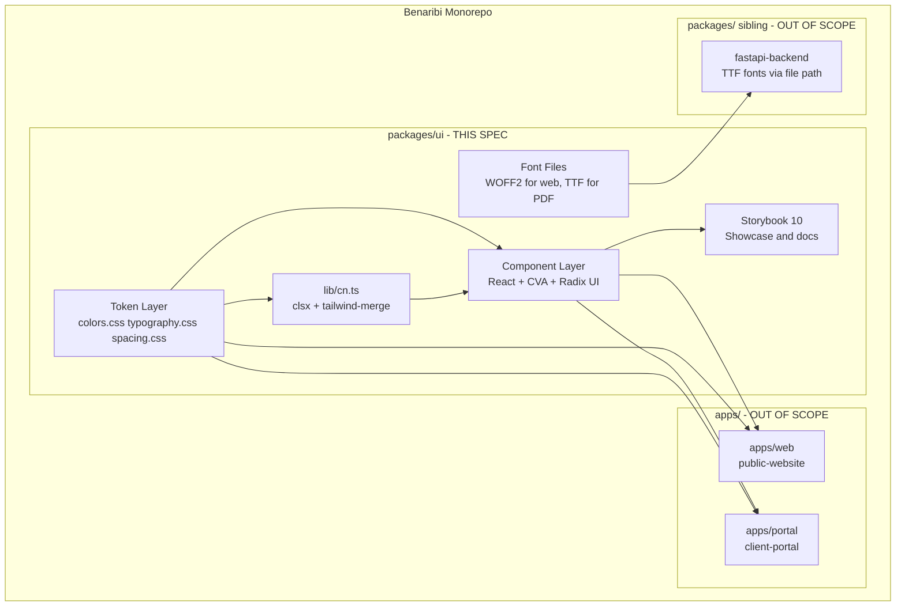

# Design Document — design-system

## Overview

The Design System is the coded brand foundation for Benaribi Agence, a luxury real estate advisory platform. It encodes the Benaribi visual identity — the charcoal-black/champagne-gold/off-white palette, Cormorant Garamond/DM Sans typography, and the arco de herradura marroquí motif — into reusable, strictly-typed React components and design tokens consumable by two frontend applications (public-website, client-portal) and one PDF generation backend (fastapi-backend).

The package is structured as a pnpm workspace package (`packages/ui`) within the Benaribi monorepo. It builds to dual ESM + CJS + TypeScript declarations via tsup, and ships a Tailwind v4 CSS file that exposes brand tokens simultaneously as utility classes and as CSS custom properties. Font files — WOFF2 for browser rendering and TTF for WeasyPrint PDF generation — are committed directly to `packages/ui/fonts/`. A Storybook 10 showcase serves as the living documentation and component verification environment.

### Goals
- Establish the single authoritative source of brand tokens (colors, typography, spacing) for the entire Benaribi platform.
- Provide WCAG AA–compliant interactive components that downstream applications assemble into pages without reimplementing brand primitives.
- Bundle font files (WOFF2 + TTF) so that the FastAPI PDF generator renders brand-accurate typography without external network requests.
- Maintain a Storybook showcase that renders all components in every variant and state for developer onboarding and visual verification.

### Non-Goals
- Application-specific components: property listing cards, operation timeline, document uploader, fiscal calculator UI (those belong in public-website and client-portal specs).
- Routing, active-link detection, or navigation state (NavigationBar and Footer are structural shells only).
- Icon library beyond the arco de herradura isotipo SVG.
- Animation frameworks or motion primitives.
- Form validation logic (components expose controlled state props; validation is the consumer's responsibility).
- Page-level composition layouts.
- Arabic (AR) or Chinese (ZH) language support.

---

## Boundary Commitments

### This Spec Owns
- Brand color tokens, typography scale, and spacing scale declared as Tailwind v4 `@theme` CSS custom properties.
- @font-face declarations and self-hosted font files (WOFF2 + TTF) committed to `packages/ui/fonts/`.
- All base interactive components: Button, Input, Textarea, Badge.
- All layout primitives: SectionWrapper, Container.
- All brand-element components: Isotipo, Logo, Divider, DarkOverlay, GeometricPattern.
- All structural shell components: NavigationBar, Footer.
- The `packages/ui` package manifest (`package.json`), build configuration (`tsup.config.ts`), and Storybook configuration.
- The minimal monorepo scaffold (`pnpm-workspace.yaml`, `turbo.json`, root `package.json`) required to make `packages/ui` consumable by sibling apps — this spec bootstraps the structure; downstream specs extend it.

### Out of Boundary
- Application-specific page components (property cards, operation timeline, ROI calculator UI).
- Routing, navigation state, or auth-awareness within NavigationBar/Footer.
- Any SVG icon beyond the brand isotipo.
- CSS resets or global base styles (each consuming app owns its own reset).
- HubSpot CRM, Supabase, or any external service integration.
- The `apps/web` and `apps/portal` workspace directories (those are created by their respective specs).

### Allowed Dependencies
- React 18 and ReactDOM (peer dependencies — not bundled; consumer apps own the installation).
- Tailwind CSS v4 (peer dependency for consuming apps; PostCSS plugin for token generation).
- `@radix-ui/react-slot` (bundled — polymorphic Button rendering).
- `class-variance-authority` / CVA (bundled — typed variant systems).
- `clsx` + `tailwind-merge` (bundled — class merging utility).
- Font files obtained via `google-webfonts-helper` (static assets committed to `fonts/` — no runtime CDN dependency).

### Revalidation Triggers
Changes that force dependent specs (public-website, client-portal, fastapi-backend) to re-check integration:
- Any change to the five named brand color token hex values or token names.
- Any change to font family names as declared in @font-face.
- Addition, removal, or renaming of font weight files in `packages/ui/fonts/`.
- Rename or removal of any exported component, TypeScript type, or CSS custom property name.
- Changes to the `@theme` token structure consumed by the Tailwind preset.

---

## Architecture

### Architecture Pattern & Boundary Map



**Dependency direction** (strictly enforced): `Tokens / Fonts` → `lib/cn` → `Components` → `Storybook (devOnly)`. No reverse imports.

**Key decisions**:
- Tailwind v4 `@theme` is used instead of a JavaScript config object so that token declarations simultaneously generate Tailwind utility classes and emit native `:root` CSS custom properties — the FastAPI CSS context reads these custom properties without any JavaScript build step.
- `packages/ui` is a workspace package (not an npm-published package), so consuming apps reference it via `workspace:*` in their `package.json` `dependencies`.
- Storybook is a `devDependency` of `packages/ui` only; it is never shipped to consumers.

### Technology Stack

| Layer | Choice / Version | Role | Notes |
|-------|-----------------|------|-------|
| Component framework | React 18 (peer) | UI component rendering | Consumer apps own the React installation |
| Styling / tokens | Tailwind CSS v4 (peer) | `@theme` → utility classes + CSS custom properties | CSS-first config; no `tailwind.config.js` for token values |
| Component variants | CVA 1.x | Typed variant systems (Button, Badge, Divider) | Generates `VariantProps<T>` TypeScript types |
| Accessibility | `@radix-ui/react-slot` | Polymorphic Button via `asChild` prop | Minimal Radix footprint; only Slot is required |
| Class merging | clsx + tailwind-merge | Conflict-free Tailwind class composition | Exported as `cn()` from `lib/cn.ts` |
| Build | tsup | ESM (`.mjs`) + CJS (`.cjs`) + `.d.ts` | esbuild-based; `dts: true` for declaration output |
| Type checking | TypeScript 5.x strict | Static type safety across library and consumers | `strict: true`; never `any` |
| Showcase | Storybook 10 + `@storybook/react-vite` | Visual showcase, a11y checks, component docs | Satisfies Req 16; `a11y` addon verifies contrast at dev time |
| Testing | Vitest + React Testing Library | Unit and interaction tests | `jsdom` environment; no separate Jest configuration |
| Font delivery — web | WOFF2 (self-hosted) | Browser @font-face | `font-display: swap`; system fallbacks declared |
| Font delivery — PDF | TTF (self-hosted) | WeasyPrint rendering | WeasyPrint does not support WOFF/WOFF2; TTF required |

---

## File Structure Plan

### Directory Structure

```
benaribi-agence/                      # Monorepo root (bootstrapped by this spec)
├── pnpm-workspace.yaml               # declares packages/* and apps/*
├── turbo.json                        # build/dev/test/storybook pipeline
├── package.json                      # devDependencies: turbo, typescript
│
├── apps/                             # OUT OF SCOPE — placeholder directories only
│   ├── web/                          # created by public-website spec
│   └── portal/                       # created by client-portal spec
│
└── packages/
    └── ui/                           # ← design-system owns everything below
        ├── package.json              # name: @benaribi/ui; peerDeps: react, tailwindcss
        ├── tsup.config.ts            # dual ESM/CJS build; dts: true; externals: react
        ├── tsconfig.json             # strict: true; paths for src alias
        ├── vitest.config.ts          # jsdom environment; setupFiles for RTL
        │
        ├── .storybook/
        │   ├── main.ts               # @storybook/react-vite builder; addons: a11y, docs
        │   └── preview.ts            # global CSS import (tokens.css); decorators
        │
        ├── fonts/                    # self-hosted font files (static, committed to git)
        │   ├── cormorant-garamond-400.woff2
        │   ├── cormorant-garamond-400italic.woff2
        │   ├── cormorant-garamond-700.woff2
        │   ├── dm-sans-400.woff2
        │   ├── dm-sans-500.woff2
        │   ├── cormorant-garamond-400.ttf     # WeasyPrint-compatible (TTF required)
        │   ├── cormorant-garamond-400italic.ttf
        │   ├── cormorant-garamond-700.ttf
        │   ├── dm-sans-400.ttf
        │   └── dm-sans-500.ttf
        │
        └── src/
            ├── index.ts              # Public barrel: re-exports all components and types
            │
            ├── tokens/
            │   ├── colors.css        # @theme: 5 brand color tokens
            │   ├── typography.css    # @theme: font families + scale; @font-face declarations
            │   ├── spacing.css       # @theme: spacing scale
            │   └── tokens.css        # Entry point: @import colors, typography, spacing
            │
            ├── lib/
            │   └── cn.ts             # cn() utility: clsx + tailwind-merge
            │
            └── components/
                ├── Button/
                │   ├── Button.tsx           # CVA variants: primary/secondary/ghost; asChild via Radix Slot
                │   ├── Button.stories.tsx
                │   └── Button.test.tsx
                ├── Card/
                │   ├── Card.tsx             # Compound: Card, CardImage, CardTitle, CardBody
                │   ├── Card.stories.tsx
                │   └── Card.test.tsx
                ├── Input/
                │   ├── Input.tsx            # Controlled; state: default|error; aria-invalid + describedby
                │   ├── Input.stories.tsx
                │   └── Input.test.tsx
                ├── Textarea/
                │   ├── Textarea.tsx         # Same state pattern as Input
                │   ├── Textarea.stories.tsx
                │   └── Textarea.test.tsx
                ├── Badge/
                │   ├── Badge.tsx            # CVA variants: success (bordered teal) / neutral / highlight
                │   ├── Badge.stories.tsx
                │   └── Badge.test.tsx
                ├── Layout/
                │   ├── SectionWrapper.tsx   # Polymorphic wrapper; consistent vertical padding
                │   ├── Container.tsx        # Max-width + responsive horizontal padding
                │   ├── Layout.stories.tsx
                │   └── Layout.test.tsx
                ├── NavigationBar/
                │   ├── NavigationBar.tsx    # Slot-based shell; useState mobile toggle; no router
                │   ├── NavigationBar.stories.tsx
                │   └── NavigationBar.test.tsx
                ├── Footer/
                │   ├── Footer.tsx           # columns + bottomBar ReactNode slots
                │   ├── Footer.stories.tsx
                │   └── Footer.test.tsx
                ├── Divider/
                │   ├── Divider.tsx          # CVA variant: full | centered; maxWidth prop
                │   ├── Divider.stories.tsx
                │   └── Divider.test.tsx
                ├── Logo/
                │   ├── Isotipo.tsx          # Inline SVG: arco de herradura; fill + size props
                │   ├── Logo.tsx             # Isotipo + "Benaribi Agence" wordmark
                │   ├── Logo.stories.tsx
                │   └── Logo.test.tsx
                ├── DarkOverlay/
                │   ├── DarkOverlay.tsx      # absolute inset-0; dark gradient; opacity prop
                │   ├── DarkOverlay.stories.tsx
                │   └── DarkOverlay.test.tsx
                └── GeometricPattern/
                    ├── GeometricPattern.tsx  # Inline SVG with <pattern>; opacity + fill props
                    ├── GeometricPattern.stories.tsx
                    └── GeometricPattern.test.tsx
```

### Modified Files
- None — this is a greenfield project. All files above are created new.

---

## Requirements Traceability

| Requirement | Summary | Components | Key Design Element |
|-------------|---------|------------|--------------------|
| 1.1 | Five named brand color tokens | Token Layer | `colors.css` `@theme` block; 5 `--color-*` custom properties |
| 1.2 | Tokens render at correct hex values | Token Layer | CSS custom properties with literal hex values |
| 1.3 | No palette extension | Token Layer | Only 5 tokens declared in `colors.css`; enforced by review |
| 2.1 | Cormorant Garamond headings, 3 weights | Token Layer | @font-face: 400 normal, 400 italic, 700 normal |
| 2.2 | DM Sans body/labels, 2 weights | Token Layer | @font-face: 400 normal, 500 normal |
| 2.3 | ≥6 type scale steps | Token Layer | 7 steps: `--text-display` through `--text-caption` |
| 2.4 | System fallbacks on load failure | Token Layer | Font stacks: `Georgia, serif` / `system-ui, sans-serif` |
| 3.1 | Font files bundled in package | fonts/ directory | 10 files committed to `packages/ui/fonts/` |
| 3.2 | Local file references; no CDN | Token Layer | @font-face `src: url('../fonts/...')` |
| 3.3 | Usable without internet | fonts/ directory | Static files — no network dependency at runtime |
| 4.1 | Button: primary / secondary / ghost | Button | CVA `buttonVariants`; 3 variant values |
| 4.2 | Hover/focus state visible | Button | `hover:` classes + `focus-visible:ring-2 focus-visible:ring-champagne-gold` |
| 4.3 | Disabled: opacity + no interaction | Button | `disabled:opacity-50 disabled:pointer-events-none` |
| 4.4 | 44×44px min touch target | Button | `min-h-[44px] min-w-[44px]` |
| 4.5 | WCAG AA contrast on Button | Button | Primary: charcoal-black on champagne-gold = 7.09:1 |
| 5.1 | Card: title / body / optional image slots | Card | Compound: `Card`, `CardImage`, `CardTitle`, `CardBody` |
| 5.2 | Brand bg + consistent padding | Card | `bg-off-white` + uniform padding token |
| 5.3 | Equal height in same-row grids | Card | `h-full` on `Card` root; consumer uses CSS grid |
| 6.1 | Input: default / focused / error states | Input | `state?: 'default' | 'error'`; focus via CSS |
| 6.2 | Textarea: default / focused / error states | Textarea | Same pattern as Input |
| 6.3 | Visible focus ring (brand color) | Input, Textarea | `focus-visible:ring-2 focus-visible:ring-champagne-gold` |
| 6.4 | Error indicator non-color-only | Input, Textarea | Error icon rendered + `aria-invalid` + `aria-describedby` |
| 6.5 | Min 44px height for touch | Input, Textarea | `min-h-[44px]` |
| 7.1 | SectionWrapper: vertical padding | SectionWrapper | `py-16 md:py-24` via spacing token |
| 7.2 | Container: max-width + responsive padding | Container | `max-w-7xl mx-auto px-4 sm:px-6 lg:px-8` |
| 7.3 | Mobile: no horizontal scroll | Container | `overflow-hidden`; responsive `px-*` |
| 7.4 | Desktop 1280px+: capped + centered | Container | `max-w-7xl mx-auto` |
| 8.1 | NavigationBar: logo / links / action slots | NavigationBar | `logo`, `links`, `action` as `React.ReactNode` props |
| 8.2 | Charcoal-black bg; WCAG AA contrast | NavigationBar | `bg-charcoal-black text-off-white` — 15.38:1 |
| 8.3 | Mobile: hide links, show toggle | NavigationBar | `useState` `isOpen`; `aria-expanded`; `aria-controls` |
| 8.4 | No route-awareness | NavigationBar | No router imports; no active state logic |
| 9.1 | Footer: multi-column + bottom-bar slots | Footer | `columns: ReactNode`, `bottomBar?: ReactNode` props |
| 9.2 | Charcoal-black bg; WCAG AA contrast | Footer | `bg-charcoal-black text-off-white` — 15.38:1 |
| 9.3 | No app-specific content | Footer | Pure structural shell; no hardcoded links or text |
| 10.1 | Divider: champagne-gold color | Divider | `bg-champagne-gold h-px` |
| 10.2 | Full-width and centered variants | Divider | CVA `variant: 'full' | 'centered'`; `maxWidth` prop |
| 11.1 | Isotipo: configurable fill + size | Isotipo | `fill` and `size` props; defaults to champagne-gold / 40px |
| 11.2 | Logo: isotipo + wordmark | Logo | `<Isotipo>` + `<span>Benaribi Agence</span>` in Cormorant |
| 11.3 | Legible at 16×16px | Isotipo | SVG optimized with simplified arch at small viewBox |
| 12.1 | DarkOverlay: dark gradient over bg image | DarkOverlay | `absolute inset-0`; linear-gradient bottom-to-top |
| 12.2 | WCAG AA large text (3:1) for white on dark | DarkOverlay | Default `opacity={0.6}` (rgba 28,28,28,0.6); enforced in prop default |
| 13.1 | GeometricPattern: repeating vector motif | GeometricPattern | Inline SVG with `<pattern>` element |
| 13.2 | Configurable opacity + fill | GeometricPattern | `opacity` and `fill` props |
| 14.1 | Badge: success / neutral / highlight | Badge | CVA: `success` (teal bordered) / `neutral` (marble-grey) / `highlight` (champagne-gold) |
| 14.2 | WCAG AA contrast on Badge text | Badge | `success`: charcoal-black on off-white bg = 15.38:1; see design decision |
| 15.1 | Text/bg ≥4.5:1 all components | All | Verified via Storybook `a11y` addon; see contrast table in research.md |
| 15.2 | Large text ≥3:1 | All | NavigationBar/Footer: 15.38:1; DarkOverlay default opacity ensures ≥3:1 |
| 15.3 | Visible focus indicators | Button, Input, Textarea | `focus-visible:ring-2 focus-visible:ring-champagne-gold focus-visible:ring-offset-2` |
| 15.4 | Error state: non-color indicator | Input, Textarea | Error icon + `aria-invalid="true"` + `aria-describedby` |
| 16.1 | Showcase renders all components/variants | Storybook | One story file per component; all variants and states covered |
| 16.2 | Runs without errors in browser | Storybook | `pnpm storybook` in `packages/ui` |
| 16.3 | Shows palette, type scale, spacing scale | Storybook | Dedicated palette, typography, and spacing token stories |

---

## Components and Interfaces

### Component Summary

| Component | Layer | Intent | Req Coverage | Key Dependencies |
|-----------|-------|--------|--------------|-----------------|
| Token Layer | Tokens | Brand tokens as CSS custom properties + Tailwind classes | 1.1–3.3 | Tailwind CSS v4 |
| Button | Interactive | Primary/secondary/ghost CTA | 4.1–4.5 | CVA, `@radix-ui/react-slot` |
| Input | Form | Styled text input with states | 6.1, 6.3–6.5 | Token Layer |
| Textarea | Form | Styled multiline input with states | 6.2–6.5 | Token Layer |
| Badge | Label | Semantic status/category label | 14.1–14.2 | CVA, Token Layer |
| SectionWrapper | Layout | Section vertical padding primitive | 7.1 | Token Layer |
| Container | Layout | Max-width + responsive gutters | 7.2–7.4 | Token Layer |
| NavigationBar | Shell | Branded nav shell with ReactNode slots | 8.1–8.4 | Token Layer |
| Footer | Shell | Branded footer shell with ReactNode slots | 9.1–9.3 | Token Layer |
| Divider | Brand | Champagne-gold horizontal rule | 10.1–10.2 | CVA, Token Layer |
| Isotipo | Brand | Arco de herradura SVG with configurable fill/size | 11.1, 11.3 | — |
| Logo | Brand | Isotipo + "Benaribi Agence" wordmark | 11.1–11.3 | Isotipo |
| DarkOverlay | Brand | Dark gradient overlay for hero images | 12.1–12.2 | Token Layer |
| GeometricPattern | Brand | Repeating vector decorative motif | 13.1–13.2 | — |

---

### Token Layer

#### colors.css, typography.css, spacing.css, tokens.css

| Field | Detail |
|-------|--------|
| Intent | Declare all brand tokens as Tailwind v4 `@theme` CSS custom properties |
| Requirements | 1.1, 1.2, 1.3, 2.1, 2.2, 2.3, 2.4, 3.1, 3.2, 3.3 |

**Responsibilities & Constraints**
- Exactly five `--color-*` properties in `colors.css`. A sixth token violates Req 1.3.
- @font-face declarations reference `../fonts/*.woff2` and `../fonts/*.ttf` via relative paths — no CDN URLs.
- `font-display: swap` on all @font-face declarations ensures no render-blocking and no invisible text during font load.
- Seven type scale steps ensure Req 2.3 (≥6) is met with one step of headroom.

**Contracts**: Service [x] / API [ ] / Event [ ] / Batch [ ] / State [ ]

##### Service Interface (CSS custom properties)
```css
/* colors.css — brand color tokens */
@theme {
  --color-charcoal-black: #1C1C1C;
  --color-off-white: #F5F3EF;
  --color-champagne-gold: #C4A35A;
  --color-teal: #3D8B7A;
  --color-marble-grey: #E0DDD8;
}

/* typography.css — font families and type scale */
@theme {
  --font-display: 'Cormorant Garamond', Georgia, serif;
  --font-body: 'DM Sans', system-ui, sans-serif;

  --text-display: 3.5rem;   /* 56px — display headlines */
  --text-h1:     2.5rem;    /* 40px */
  --text-h2:     2rem;      /* 32px */
  --text-h3:     1.5rem;    /* 24px */
  --text-h4:     1.25rem;   /* 20px */
  --text-body:   1rem;      /* 16px */
  --text-caption: 0.875rem; /* 14px */
}

/* @font-face declarations in typography.css (pattern for each weight) */
@font-face {
  font-family: 'Cormorant Garamond';
  src: url('../fonts/cormorant-garamond-400.woff2') format('woff2'),
       url('../fonts/cormorant-garamond-400.ttf') format('truetype');
  font-weight: 400;
  font-style: normal;
  font-display: swap;
}
/* repeat for 400 italic, 700 normal; DM Sans 400, 500 */
```

**Implementation Notes**
- Integration: consuming apps add `@import "@benaribi/ui/tokens.css"` before `@import "tailwindcss"` in their global stylesheet.
- Validation: Storybook palette and typography stories provide visual regression anchors for any token drift.
- Risks: Font files must be committed to `git`. Document in CI onboarding that missing TTF files break WeasyPrint integration tests.

---

### Interactive Components

All interactive components share a common base props pattern:

```typescript
// Shared pattern — each component extends the relevant HTML element's attributes
type FormFieldProps<T extends HTMLElement> = React.HTMLAttributes<T> & {
  state?: 'default' | 'error';
  errorMessage?: string;
  label?: string;
};
```

#### Button

| Field | Detail |
|-------|--------|
| Intent | Polymorphic CTA button with three brand-aligned variants |
| Requirements | 4.1, 4.2, 4.3, 4.4, 4.5 |

**Responsibilities & Constraints**
- Three variants: `primary` (champagne-gold fill + charcoal-black text, 7.09:1), `secondary` (charcoal-black outline), `ghost` (text-only with visible hover treatment).
- Minimum 44×44px touch target enforced unconditionally via Tailwind classes.
- Disabled state: reduced opacity and suppressed pointer events — no hover feedback.
- Polymorphic rendering: `asChild` prop via Radix `Slot` allows the consumer to render the Button as an `<a>` or other element while preserving all visual classes.

**Dependencies**
- External: `@radix-ui/react-slot` — polymorphic asChild rendering (P1)
- External: CVA — typed variant generation (P0)

**Contracts**: Service [x] / API [ ] / Event [ ] / Batch [ ] / State [ ]

##### Service Interface
```typescript
import { type VariantProps, cva } from 'class-variance-authority';
import { Slot } from '@radix-ui/react-slot';

const buttonVariants = cva(
  [
    'inline-flex items-center justify-center',
    'min-h-[44px] min-w-[44px]',
    'rounded font-body font-medium transition-colors',
    'focus-visible:outline-none focus-visible:ring-2',
    'focus-visible:ring-champagne-gold focus-visible:ring-offset-2',
    'disabled:opacity-50 disabled:pointer-events-none',
  ].join(' '),
  {
    variants: {
      variant: {
        primary:   'bg-champagne-gold text-charcoal-black hover:bg-champagne-gold/90',
        secondary: 'border border-charcoal-black text-charcoal-black hover:bg-charcoal-black/5',
        ghost:     'text-charcoal-black hover:bg-charcoal-black/5',
      },
      size: {
        sm:      'px-4 py-2 text-caption',
        default: 'px-6 py-3 text-body',
        lg:      'px-8 py-4 text-h4',
      },
    },
    defaultVariants: { variant: 'primary', size: 'default' },
  }
);

interface ButtonProps
  extends React.ButtonHTMLAttributes<HTMLButtonElement>,
    VariantProps<typeof buttonVariants> {
  asChild?: boolean;
}
```
- Preconditions: none (stateless presentational component).
- Postconditions: rendered element has implicit `role="button"` or the role inherited from the `asChild` element.
- Invariants: `primary` variant contrast is always 7.09:1 (charcoal-black on champagne-gold).

---

#### Input

| Field | Detail |
|-------|--------|
| Intent | Brand-styled text input with default, focused, and error states |
| Requirements | 6.1, 6.3, 6.4, 6.5 |

**Responsibilities & Constraints**
- Focus state is CSS-driven via `focus-visible:` — no JavaScript state required for focus.
- Error state (`state="error"`) renders an error icon adjacent to the field AND sets `aria-invalid="true"` and `aria-describedby` pointing to the error message element — satisfying the non-color indicator requirement (Req 6.4, 15.4).
- `errorMessage` is required when `state="error"` (TypeScript discriminated union enforces this).

**Contracts**: Service [x] / API [ ] / Event [ ] / Batch [ ] / State [ ]

##### Service Interface
```typescript
type InputProps =
  | (React.InputHTMLAttributes<HTMLInputElement> & {
      state?: 'default';
      errorMessage?: never;
      label?: string;
    })
  | (React.InputHTMLAttributes<HTMLInputElement> & {
      state: 'error';
      errorMessage: string;
      label?: string;
    });
```
- Preconditions: when `state === 'error'`, `errorMessage` must be a non-empty string.
- Postconditions: when `state === 'error'`, the rendered DOM includes `aria-invalid="true"`, `aria-describedby="<id>-error"`, an error icon, and an error message element with `id="<id>-error"`.
- Invariants: focus ring always uses `--color-champagne-gold`; minimum height is always 44px.

---

#### Textarea

Follows the identical state machine and ARIA pattern as Input. Extends `React.TextareaHTMLAttributes<HTMLTextAreaElement>` with the same discriminated union as `InputProps`. Implementation is a direct parallel — shared test patterns, same Storybook story structure.

---

### Content Components

#### Card

| Field | Detail |
|-------|--------|
| Intent | Structured content container with title, body, and optional top image slots |
| Requirements | 5.1, 5.2, 5.3 |

**Responsibilities & Constraints**
- Compound component pattern — consumers import and compose named sub-components.
- `Card` root applies `h-full` so that sibling cards in a CSS grid row share equal height (Req 5.3 is a consumer-side grid concern; `h-full` is the library-side contribution).
- `CardImage` is optional and always rendered at the top of the card (before `CardTitle` and `CardBody`).

**Contracts**: Service [x] / API [ ] / Event [ ] / Batch [ ] / State [ ]

##### Service Interface
```typescript
interface CardProps extends React.HTMLAttributes<HTMLDivElement> {}
// Applies: bg-off-white h-full rounded overflow-hidden

interface CardImageProps {
  src: string;
  alt: string;
  className?: string;
}
// Renders:  with object-cover; always at card top

interface CardTitleProps extends React.HTMLAttributes<HTMLHeadingElement> {
  as?: 'h2' | 'h3' | 'h4'; // default: 'h3'
}

interface CardBodyProps extends React.HTMLAttributes<HTMLDivElement> {}
```

---

### Label Components

#### Badge

| Field | Detail |
|-------|--------|
| Intent | Semantic status/category label with three brand-aligned variants |
| Requirements | 14.1, 14.2 |

**Responsibilities & Constraints**
- `success` variant uses a **bordered/outline** style (teal `#3D8B7A` border, off-white `#F5F3EF` background, charcoal-black `#1C1C1C` text) — this achieves 15.38:1 contrast for normal text. A solid teal fill achieves only ~3.66–4.14:1 against any text color, which fails WCAG AA 4.5:1 for normal text. See research.md for full analysis and rationale.
- `neutral`: marble-grey (`#E0DDD8`) fill, charcoal-black text — 12.58:1.
- `highlight`: champagne-gold (`#C4A35A`) fill, charcoal-black text — 7.09:1.
- All three variants pass WCAG AA 4.5:1 for normal text.

**Contracts**: Service [x] / API [ ] / Event [ ] / Batch [ ] / State [ ]

##### Service Interface
```typescript
const badgeVariants = cva(
  'inline-flex items-center rounded-full px-3 py-1 text-caption font-medium font-body',
  {
    variants: {
      variant: {
        success:   'border border-teal bg-off-white text-charcoal-black',
        neutral:   'bg-marble-grey text-charcoal-black',
        highlight: 'bg-champagne-gold text-charcoal-black',
      },
    },
    defaultVariants: { variant: 'neutral' },
  }
);

interface BadgeProps
  extends React.HTMLAttributes<HTMLSpanElement>,
    VariantProps<typeof badgeVariants> {}
```
- Invariants: all three variants maintain ≥4.5:1 contrast ratio for normal text (caption size, 14px).

---

### Layout Components

#### SectionWrapper

| Field | Detail |
|-------|--------|
| Intent | Consistent vertical padding for page sections |
| Requirements | 7.1 |

```typescript
interface SectionWrapperProps extends React.HTMLAttributes<HTMLElement> {
  as?: React.ElementType; // default: 'section'
}
// Renders: <as className="py-16 md:py-24 {className}">
```

#### Container

| Field | Detail |
|-------|--------|
| Intent | Max-width content area with responsive horizontal padding |
| Requirements | 7.2, 7.3, 7.4 |

```typescript
interface ContainerProps extends React.HTMLAttributes<HTMLDivElement> {}
// Renders: <div className="max-w-7xl mx-auto px-4 sm:px-6 lg:px-8 overflow-hidden w-full">
```
- `overflow-hidden` prevents horizontal scroll on mobile (Req 7.3).
- `max-w-7xl` (1280px) caps and centers content on large viewports (Req 7.4).

---

### Shell Components

#### NavigationBar

| Field | Detail |
|-------|--------|
| Intent | Branded navigation shell with logo/links/action slots; mobile-responsive |
| Requirements | 8.1, 8.2, 8.3, 8.4 |

**Responsibilities & Constraints**
- Three named `ReactNode` slots — `logo`, `links`, `action` — give consumers full control over content.
- Mobile toggle managed via `useState` with `aria-expanded` / `aria-controls` on the toggle button and the collapsible links panel. No third-party disclosure library needed.
- Zero router imports. The `links` slot accepts arbitrary `ReactNode`; active link styling is the consumer's responsibility.

**Contracts**: Service [x] / API [ ] / Event [ ] / Batch [ ] / State [x]

##### Service Interface
```typescript
interface NavigationBarProps {
  logo: React.ReactNode;
  links: React.ReactNode;
  action?: React.ReactNode;
  className?: string;
}
```

##### State Management
- State model: `{ isOpen: boolean }` — local to NavigationBar; no external store.
- Persistence: none (ephemeral; resets on unmount).
- Concurrency: none.

---

#### Footer

| Field | Detail |
|-------|--------|
| Intent | Branded footer shell with multi-column and bottom-bar slots |
| Requirements | 9.1, 9.2, 9.3 |

```typescript
interface FooterProps {
  columns: React.ReactNode;
  bottomBar?: React.ReactNode;
  className?: string;
}
// Root: <footer className="bg-charcoal-black text-off-white">
```

---

### Brand Element Components

#### Isotipo

```typescript
interface IsotipoProps {
  fill?: string;          // default: 'var(--color-champagne-gold)'
  size?: number | string; // default: 40; applied as width + height
  className?: string;
}
```
- Renders an inline SVG with the arco de herradura arch shape.
- SVG viewBox is optimized so the arch silhouette remains legible at `size={16}` (Req 11.3).

#### Logo

```typescript
interface LogoProps {
  fill?: string;          // forwarded to Isotipo
  size?: number | string; // forwarded to Isotipo
  className?: string;
}
// Renders: <div className="flex items-center gap-3"><Isotipo /><span font-display>Benaribi Agence</span></div>
```

#### Divider

```typescript
const dividerVariants = cva('block bg-champagne-gold h-px', {
  variants: {
    variant: {
      full:     'w-full',
      centered: 'mx-auto',
    },
  },
  defaultVariants: { variant: 'full' },
});

interface DividerProps
  extends React.HTMLAttributes<HTMLHRElement>,
    VariantProps<typeof dividerVariants> {
  maxWidth?: string; // e.g. '120px'; applied only when variant='centered'
}
```

#### DarkOverlay

```typescript
interface DarkOverlayProps {
  opacity?: number;   // 0–1; default 0.6 — ensures ≥3:1 WCAG AA large text contrast
  className?: string;
}
// Renders: <div className="absolute inset-0 pointer-events-none"
//   style={{ background: `linear-gradient(to bottom, transparent 0%, rgba(28,28,28,${opacity}) 100%)` }} />
```
- The default `opacity={0.6}` is not arbitrary — it is the minimum value that ensures the darkened area achieves ≥3:1 contrast against white headline text (Req 12.2). Do not lower the default.

#### GeometricPattern

```typescript
interface GeometricPatternProps {
  opacity?: number;   // 0–1; default 0.1
  fill?: string;      // default: 'var(--color-champagne-gold)'
  width?: number;     // SVG width; default: 400
  height?: number;    // SVG height; default: 400
  className?: string;
}
// Renders: inline SVG with a <defs><pattern> that tiles the arco de herradura geometry
```

---

## Testing Strategy

### Unit Tests (Vitest + React Testing Library)

1. **Button variants**: Render `primary`, `secondary`, and `ghost` variants; assert computed class names include the correct CVA output for each variant. Render `disabled` state; simulate click; assert `onClick` was not called and `opacity-50` class is present.
2. **Button asChild**: Render `<Button asChild><a href="/test">...</a></Button>`; assert the DOM root is an `<a>` element with `href="/test"` and all button classes applied.
3. **Input/Textarea error state**: Render with `state="error"` and `errorMessage="Required"`; assert `aria-invalid="true"`, `aria-describedby` matches the error element id, an error icon is in the DOM, and the error message text is rendered.
4. **NavigationBar mobile toggle**: Render with `links` content; initially assert links panel is not visible and toggle has `aria-expanded="false"`; fire click on toggle; assert `aria-expanded="true"` and links panel becomes visible.
5. **Badge contrast variants**: Render all three variants; assert `success` variant class list includes the bordered pattern (`border-teal bg-off-white text-charcoal-black`), `neutral` includes `bg-marble-grey`, and `highlight` includes `bg-champagne-gold`.

### Integration Tests

1. **Card equal height**: Render three Cards with varying body content inside a grid; assert all `Card` root elements have the `h-full` class applied.
2. **Logo composition**: Render `<Logo />`; assert the DOM contains both an `<svg>` (Isotipo) and a text node containing "Benaribi Agence".
3. **DarkOverlay opacity default**: Render `<DarkOverlay />`; assert the inline `style` background gradient includes `rgba(28,28,28,0.6)`.
4. **NavigationBar slot rendering**: Pass distinct `logo`, `links`, and `action` elements; assert each testid/label renders in the correct structural position (logo left, links center, action right).

### Storybook Visual / Accessibility Stories

1. **Palette story**: Renders five color swatches with hex labels — visual regression anchor for all brand token values (Req 16.3). Storybook `a11y` addon reports any contrast violations.
2. **Typography scale story**: Renders all seven type scale steps in Cormorant Garamond (headings) and DM Sans (body/caption) — verifies self-hosted font loading and scale rendering (Req 16.3, 2.1–2.3).
3. **Button all variants and states**: Renders primary/secondary/ghost × default/hover/focus/disabled — Storybook a11y addon checks WCAG AA contrast on each combination (Req 4.5, 15.1).
4. **Input/Textarea error story**: Renders error state in isolation — visually confirms non-color error indicator (icon + text) is present alongside field-level color change (Req 6.4, 15.4).
5. **Isotipo at 16×16**: Dedicated story renders Isotipo at `size={16}` — visual smoke test confirming arch silhouette legibility at minimum size (Req 11.3).

---

## Error Handling

The design system is a component library. Errors surface as TypeScript compile-time failures and development-mode prop warnings, not runtime exceptions.

- **Invalid props**: TypeScript strict mode and `VariantProps<T>` inference catch invalid variant values and missing required props at consumer build time.
- **Font load failure**: `font-display: swap` + declared system fallbacks ensure text renders with fallback fonts immediately; no JavaScript error handling is needed (Req 2.4).
- **Missing font files at build time**: `tsup.config.ts` includes a pre-build assertion that all expected files in `fonts/` are present — failing CI before a broken artifact is published.
- **DarkOverlay opacity out of range**: The `opacity` prop is typed as `number`; a runtime guard clamps it to `[0, 1]` and warns in development mode if an invalid value is passed.

### Monitoring
No runtime monitoring applies to a component library. The Storybook `@storybook/addon-a11y` provides continuous accessibility monitoring during development, surfacing contrast ratio failures and missing ARIA attributes in the browser panel.

---

## Performance & Scalability

- **Tailwind v4 `@theme`**: utility classes are generated only for those used in consuming app code (PostCSS content scanning tree-shaking). No unused CSS ships in production.
- **WOFF2**: ~30% smaller than WOFF; `font-display: swap` eliminates render-blocking.
- **Inline SVGs** (Isotipo, GeometricPattern): rendered as React components — zero network requests, no FOIC (flash of invisible content).
- **tsup dual output**: ESM (`.mjs`) for bundler tree-shaking; CJS (`.cjs`) as fallback for Node.js tooling. Consuming apps import only what they use.
- **CSS custom properties**: token resolution is a browser-native parse-time operation — zero JavaScript runtime overhead.
