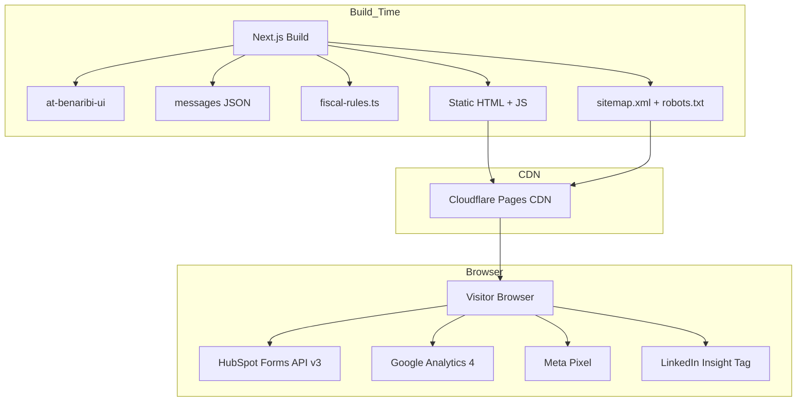
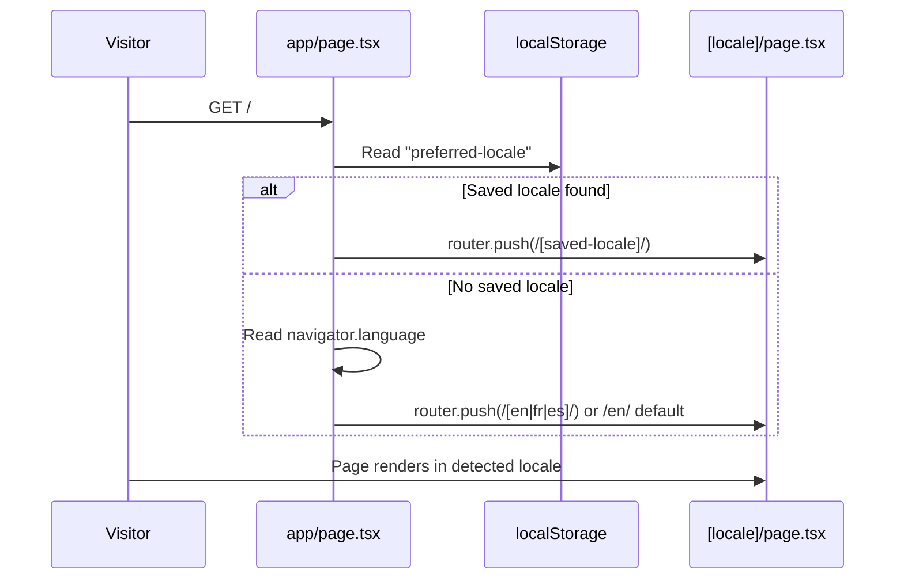
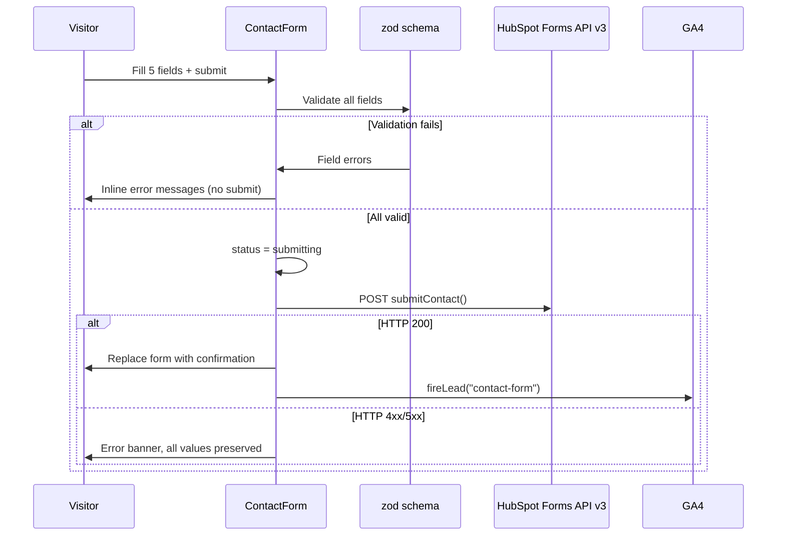
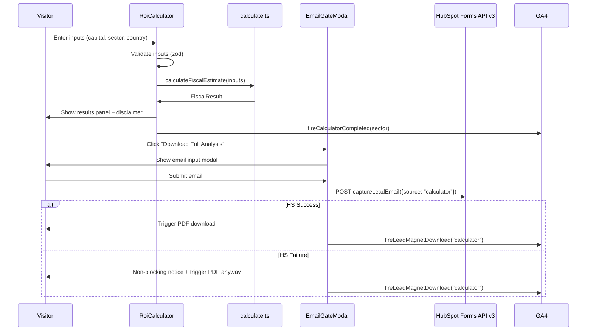

# Design Document — public-website

## Overview

The public-website is the primary digital presence for Benaribi Agence at benaribi.ma. It is a statically generated marketing site (Next.js 15, `output: 'export'`) deployed to a CDN, targeting international HNWIs and industrial companies researching Morocco as an investment destination. All UI components are imported from `@benaribi/ui`; content is served in EN/FR/ES via next-intl; leads are captured through HubSpot Free CRM via the Forms API v3 from the browser with no proxy. A pure-JavaScript ROI Fiscal Calculator on `/investment` provides indicative tax estimates without backend dependencies.

**Purpose**: Generate qualified inbound leads and establish institutional credibility comparable to JLL.com/Savills.com while being fully discoverable via international SEO.

**Users**: International HNWIs, industrial companies, and foreign entities researching Morocco investment opportunities — primarily arriving via organic search (EN/FR/ES) or referral.

**Impact**: Creates Benaribi Agence's first digital channel for organic lead generation. Enables SEO indexing across three languages.

### Goals

- Generate qualified inbound leads via segmented contact form and email-gated lead magnet
- Establish institutional visual credibility using the `@benaribi/ui` design system
- Rank for EN/FR Morocco investment terms via pre-rendered static HTML with per-page SEO metadata
- Provide a self-service fiscal orientation tool (ROI Calculator v1) that converts visitors into leads

### Non-Goals

- Client portal authentication or any private/authenticated content (→ client-portal spec)
- AR/ZH language support (→ Phase 2/3)
- Backend-connected ROI Calculator v2 (→ fastapi-backend spec)
- CMS, blog, or any dynamic content management
- Content production: copy, photography, drone video (→ supplied externally)
- Paid advertising setup or tracking infrastructure beyond pixel installation

---

## Boundary Commitments

### This Spec Owns

- All public-facing page routes and their static HTML pre-rendering
- Multilingual content layer: EN/FR/ES JSON messages, locale routing (`/[locale]/...`), browser language detection (client-side)
- ROI Fiscal Calculator v1: inputs, fiscal rule data, calculation logic, results UI, and email gate
- HubSpot Forms API v3 integration: contact form submission and lead magnet email capture
- Analytics instrumentation: GA4, Meta Pixel, LinkedIn Insight Tag script loading and conversion events
- SEO layer: `generateMetadata` per page/locale, Open Graph, hreflang, sitemap.xml, robots.txt
- Core Web Vitals and WCAG AA compliance
- Static asset orchestration: images, video, PDF download served from `public/`

### Out of Boundary

- Design tokens, base components, WOFF2 fonts → `@benaribi/ui` (design-system spec)
- Client portal pages and authentication flows → client-portal spec
- AR/ZH translations → Phase 2/3
- Server-side API routes or server-rendered pages → static export constraint prohibits it
- Content production: copy, images, drone video → supplied externally before launch
- HubSpot portal configuration (form creation, field mapping) → platform admin task, not code

### Allowed Dependencies

- `@benaribi/ui` — all visual components and Tailwind v4 CSS tokens
- `next-intl` v3 — i18n routing and string resolution
- `react-hook-form` + `zod` — form state and validation
- `@next/third-parties` — GA4 script injection
- `next-sitemap` — post-build sitemap.xml + robots.txt
- HubSpot Forms API v3 (external) — unauthenticated browser submission
- GA4 / Meta Pixel / LinkedIn Insight Tag (external) — analytics platforms

### Revalidation Triggers

- `@benaribi/ui` component API changes (prop renames, removed exports) → SiteNav, Hero, ServicesGrid, ContactForm must be re-checked
- HubSpot portal migration or form GUID/portalId changes → `client.ts` env vars and HubSpot form configuration
- Next.js breaking changes in `output: 'export'` or App Router metadata API
- Addition of a new locale (AR, ZH) → `generateStaticParams`, `middleware.ts` (if enabled), `messages/` files, `next-sitemap.config.js`
- Calculator fiscal rule update (Moroccan law change) → `fiscal-rules.ts` version bump + regression tests

---

## Architecture

### Architecture Pattern & Boundary Map

Static Site Generation (SSG) pattern: Next.js 15 App Router with `output: 'export'`. All pages pre-render to static HTML at build time. No server runtime. Deployed to CDN (Cloudflare Pages or Vercel with static hosting).



**Key Decisions:**
- SSG chosen over Vite SPA: native `generateMetadata`, `next/image`, and `next-sitemap` satisfy SEO requirements (8.5, 9.1–9.7, 11.1–11.4) with near-zero boilerplate. See `research.md` for trade-off analysis.
- No middleware: next-intl middleware requires Edge Runtime, incompatible with static export; browser language detection handled client-side in `app/page.tsx`.

### Technology Stack

| Layer | Choice / Version | Role | Notes |
|-------|-----------------|------|-------|
| Framework | Next.js 15 | SSG, routing, metadata, image optimization | `output: 'export'` |
| UI Components | `@benaribi/ui` 0.0.0 | All visual components + CSS tokens | Monorepo package |
| Styling | Tailwind CSS v4 | Utility classes | Matches design-system peer dep — not v3 |
| i18n | next-intl v3 | EN/FR/ES routing + string resolution | No middleware (static export) |
| Forms | react-hook-form v7 + zod | Form state + typed validation | Both forms use same stack |
| Analytics | @next/third-parties | GA4 script injection | `GoogleAnalytics` component |
| Sitemap | next-sitemap | Post-build sitemap.xml + robots.txt | Runs after `next build` |
| Language | TypeScript 5 (strict) | Full type safety | `strict: true`, no `any` |
| Package manager | pnpm 8 | Monorepo workspace | Existing monorepo toolchain |
| Build orchestration | Turbo | `apps/web` pipeline | Existing `turbo.json` |

---

## File Structure Plan

### Directory Structure

```
apps/web/
├── app/
│   ├── page.tsx                         # Root shell: client-side locale redirect
│   ├── layout.tsx                       # Root HTML: <html>, charset, font preload
│   ├── not-found.tsx                    # Global 404
│   └── [locale]/
│       ├── layout.tsx                   # Per-locale: NextIntlClientProvider, hreflang, AnalyticsProvider, SiteNav, Footer
│       ├── page.tsx                     # Home
│       ├── services/
│       │   ├── residential/page.tsx
│       │   ├── industrial/page.tsx
│       │   └── company-setup/page.tsx
│       ├── investment/
│       │   └── page.tsx                 # Investment landscape + RoiCalculator
│       ├── about/
│       │   └── page.tsx
│       ├── resources/
│       │   └── page.tsx                 # Lead magnet
│       └── contact/
│           └── page.tsx
├── components/
│   ├── layout/
│   │   ├── SiteNav.tsx                  # NavigationBar wrapper + locale-aware links
│   │   ├── LanguageSwitcher.tsx         # EN/FR/ES toggle (Client Component)
│   │   └── WhatsAppButton.tsx           # Persistent float button (Client Component)
│   ├── sections/
│   │   ├── home/
│   │   │   ├── Hero.tsx                 # Full-width hero: video + static image fallback
│   │   │   ├── ServicesGrid.tsx         # 3-card services section
│   │   │   ├── WhyMorocco.tsx           # Macro investment data
│   │   │   ├── WhyBenaribi.tsx          # Firm differentiators
│   │   │   └── HomeCTA.tsx              # Closing CTA
│   │   ├── services/
│   │   │   ├── ServiceHero.tsx          # Per-service hero
│   │   │   ├── ServiceBody.tsx          # Description + benefits
│   │   │   └── ServiceCTA.tsx           # Bottom contact CTA
│   │   ├── investment/
│   │   │   ├── InvestmentLandscape.tsx  # Morocco + Charte 2022 editorial
│   │   │   └── RoiCalculator.tsx        # Calculator UI + 3-step state machine
│   │   ├── about/
│   │   │   ├── FirmStory.tsx
│   │   │   └── TeamSection.tsx
│   │   ├── resources/
│   │   │   └── LeadMagnetBlock.tsx      # Morocco Investment Guide description + CTA
│   │   └── contact/
│   │       └── ContactForm.tsx          # 5-field segmented form
│   └── shared/
│       ├── EmailGateModal.tsx           # Reusable email-gate modal (resources + calculator)
│       └── AnalyticsProvider.tsx        # GA4 + Meta Pixel + LinkedIn Insight Tag scripts
├── lib/
│   ├── calculator/
│   │   ├── fiscal-rules.ts             # Hardcoded tax rule data (Charte 2022)
│   │   ├── calculate.ts                # Pure function: CalculatorInputs → FiscalResult
│   │   └── calculate.test.ts
│   ├── hubspot/
│   │   └── client.ts                   # submitContact() + captureLeadEmail()
│   ├── analytics/
│   │   └── events.ts                   # fireLead(), fireLeadMagnetDownload(), fireCalculatorCompleted()
│   └── i18n/
│       └── navigation.ts               # next-intl useRouter / usePathname re-exports
├── messages/
│   ├── en.json                         # Base translation strings
│   ├── fr.json
│   └── es.json
├── public/
│   ├── assets/
│   │   └── images/                     # Supplied externally (hero, team, etc.)
│   └── downloads/
│       └── morocco-investment-guide-2026.pdf   # Supplied externally
├── i18n.ts                             # next-intl routing config (locales, defaultLocale)
├── next.config.ts                      # output: 'export', images config
├── next-sitemap.config.js              # Sitemap + robots.txt post-build config
└── package.json
```

### Modified Files

- `package.json` (root) — add `apps/web` to pnpm workspace
- `turbo.json` (root) — add `web#build` and `web#dev` pipeline tasks

---

## System Flows

### Flow 1 — Locale Detection & Routing



### Flow 2 — Contact Form Submission



### Flow 3 — Calculator + Email Gate + PDF



---

## Requirements Traceability

| Requirement | Summary | Components | Interfaces / Contracts | Flows |
|-------------|---------|------------|------------------------|-------|
| 1.1 | Page routes | `[locale]/*/page.tsx` | `generateStaticParams` | — |
| 1.2 | 404 page | `not-found.tsx` | — | — |
| 1.3 | Persistent navbar | `SiteNav` + `NavigationBar` | `NavigationBarProps` | — |
| 1.4 | Hamburger menu | `NavigationBar` (built-in) | — | — |
| 1.5 | Mobile overlay | `NavigationBar` (built-in) | — | — |
| 1.6 | Footer | `Footer` from `@benaribi/ui` | `FooterProps` | — |
| 1.7 | WhatsApp button | `WhatsAppButton` | — | — |
| 2.1 | Hero section | `Hero` | `HeroProps` | — |
| 2.2 | Hero static fallback | `Hero` (`` behind `<video>`) | — | — |
| 2.3 | Services section | `ServicesGrid` | — | — |
| 2.4 | Why Morocco | `WhyMorocco` | — | — |
| 2.5 | Why Benaribi | `WhyBenaribi` | — | — |
| 2.6 | Home closing CTA | `HomeCTA` | — | — |
| 3.1 | Service page routes | `[locale]/services/*/page.tsx` | — | — |
| 3.2 | Service page sections | `ServiceHero`, `ServiceBody`, `ServiceCTA` | — | — |
| 3.3 | Translated service content | next-intl `useTranslations` | `MessageSchema` | — |
| 4.1 | Investment landscape | `InvestmentLandscape` | — | — |
| 4.2 | Calculator inputs | `RoiCalculator` | `CalculatorInputs` | Flow 3 |
| 4.3 | Calculator outputs | `RoiCalculator` results panel | `FiscalResult` | Flow 3 |
| 4.4 | Calculator validation | `RoiCalculator` + zod | zod schema | Flow 3 |
| 4.5 | No network requests | `calculate.ts` | `calculateFiscalEstimate` | Flow 3 |
| 4.6 | Disclaimer | `RoiCalculator` results panel | — | — |
| 4.7 | Email gate after results | `EmailGateModal` (source=calculator) | `EmailGateProps` | Flow 3 |
| 5.1 | Firm story | `FirmStory` | — | — |
| 5.2 | Team section | `TeamSection` | — | — |
| 5.3 | About contact CTA | `about/page.tsx` | — | — |
| 6.1 | Resources page + guide | `LeadMagnetBlock` | — | — |
| 6.2 | Email gate on resources | `EmailGateModal` (source=resources) | `EmailGateProps` | — |
| 6.3 | HubSpot + PDF delivery | `client.ts captureLeadEmail` | `HubSpotLeadEmailFields` | — |
| 6.4 | Email validation | `EmailGateModal` + zod | — | — |
| 6.5 | Graceful HubSpot failure | `EmailGateModal` + `client.ts` | — | Flow 3 |
| 6.6 | No account required | `EmailGateModal` (email only) | — | — |
| 7.1 | Contact form fields | `ContactForm` | `ContactFormValues` | Flow 2 |
| 7.2 | HubSpot submission | `client.ts submitContact` | `HubSpotContactFields` | Flow 2 |
| 7.3 | Success confirmation | `ContactForm` (success state) | — | — |
| 7.4 | Error + preserve fields | `ContactForm` (error state) | — | — |
| 7.5 | Inline validation | `ContactForm` + react-hook-form | — | Flow 2 |
| 7.6 | Alt contact options | `contact/page.tsx` | — | — |
| 7.7 | Keyboard navigation | `ContactForm` (semantic HTML + ARIA) | — | — |
| 8.1 | 3 languages | next-intl + messages JSON | `MessageSchema` | — |
| 8.2 | Language switcher | `LanguageSwitcher` | — | — |
| 8.3 | Instant re-render | next-intl `useRouter.replace` | — | — |
| 8.4 | Browser language detection | `app/page.tsx` (client redirect) | — | Flow 1 |
| 8.5 | hreflang tags | `[locale]/layout.tsx generateMetadata` | `Metadata.alternates` | — |
| 8.6 | EN fallback | next-intl `defaultTranslationValues` | — | — |
| 8.7 | Translated metadata | `generateMetadata` per page | `Metadata` | — |
| 9.1 | Unique title + description | `generateMetadata` per page/locale | `Metadata` | — |
| 9.2 | Open Graph + Twitter Card | `generateMetadata` per page | `OpenGraph` | — |
| 9.3 | sitemap.xml | `next-sitemap` (post-build) | — | — |
| 9.4 | robots.txt | `next-sitemap` (post-build) | — | — |
| 9.5 | Alt text on all images | All `next/image` usages | `alt` required prop | — |
| 9.6 | Semantic HTML | All page layouts | HTML5 landmark elements | — |
| 9.7 | Canonical tags | `generateMetadata` (canonical) | `Metadata.alternates.canonical` | — |
| 10.1 | GA4 page views | `AnalyticsProvider` + `GoogleAnalytics` | — | — |
| 10.2 | Meta Pixel PageView | `AnalyticsProvider` (Meta Pixel script) | — | — |
| 10.3 | LinkedIn Insight Tag | `AnalyticsProvider` (LinkedIn script) | — | — |
| 10.4 | Lead conversion event | `events.ts fireLead` | `fireLead` | Flow 2 |
| 10.5 | LeadMagnetDownload event | `events.ts fireLeadMagnetDownload` | `fireLeadMagnetDownload` | Flow 3 |
| 10.6 | CalculatorCompleted event | `events.ts fireCalculatorCompleted` | `fireCalculatorCompleted` | Flow 3 |
| 10.7 | Non-blocking scripts | `next/script strategy="afterInteractive"` | — | — |
| 11.1 | LCP ≤ 2.5 s | `Hero` (next/image priority) | — | — |
| 11.2 | Font-display swap | design-system CSS tokens | — | — |
| 11.3 | Lazy/eager image loading | `next/image loading` prop | — | — |
| 11.4 | Image CLS prevention | `next/image width + height` | — | — |
| 11.5 | 44×44 touch targets | Tailwind `min-h-[44px] min-w-[44px]` | — | — |
| 11.6 | Focus indicators | Tailwind `focus-visible:ring-2` | — | — |
| 11.7 | WCAG AA contrast | Design tokens (charcoal-black / off-white) | — | — |
| 11.8 | Keyboard navigation | Semantic HTML + ARIA | — | — |

---

## Components and Interfaces

### Summary Table

| Component | Layer | Intent | Req Coverage | Key Dependencies |
|-----------|-------|--------|--------------|-----------------|
| `SiteNav` | Layout | NavigationBar wrapper with locale links + LanguageSwitcher | 1.3, 1.4, 1.5 | NavigationBar P0, LanguageSwitcher P0 |
| `LanguageSwitcher` | Layout | EN/FR/ES toggle with localStorage persistence | 8.2, 8.3 | next-intl P0 |
| `WhatsAppButton` | Layout | Persistent float button | 1.7 | — |
| `Hero` | Section | Video hero + static image fallback | 2.1, 2.2, 11.1, 11.3, 11.4 | next/image P0, DarkOverlay P1 |
| `ServicesGrid` | Section | 3-card services overview | 2.3 | Card P0 |
| `WhyMorocco` | Section | Macro investment data | 2.4 | SectionWrapper P0 |
| `WhyBenaribi` | Section | Firm differentiators | 2.5 | SectionWrapper P0 |
| `HomeCTA` | Section | Closing CTA | 2.6 | Button P0 |
| `ServiceHero` | Section | Per-service hero | 3.2 | DarkOverlay P1 |
| `ServiceBody` | Section | Description + benefits | 3.2, 3.3 | SectionWrapper P0 |
| `ServiceCTA` | Section | Bottom contact CTA | 3.2 | Button P0 |
| `InvestmentLandscape` | Section | Morocco + Charte 2022 editorial | 4.1 | SectionWrapper P0 |
| `RoiCalculator` | Section | 3-step calculator UI + state machine | 4.2–4.7, 10.6 | calculate.ts P0, EmailGateModal P0 |
| `EmailGateModal` | Shared | Reusable email-gate + PDF delivery | 4.7, 6.2–6.6 | client.ts P0 |
| `LeadMagnetBlock` | Section | Morocco Investment Guide description + CTA | 6.1, 6.2 | EmailGateModal P0 |
| `ContactForm` | Section | 5-field segmented form with HubSpot + events | 7.1–7.7, 10.4 | client.ts P0, react-hook-form P0 |
| `FirmStory` | Section | Firm history + positioning | 5.1 | SectionWrapper P0 |
| `TeamSection` | Section | Advisor profiles | 5.2 | Card P0 |
| `AnalyticsProvider` | Provider | Non-blocking script loading for 3 platforms | 10.1–10.3, 10.7 | next/script P0 |
| `calculate.ts` | Lib | Pure fiscal calculation function | 4.2–4.5 | fiscal-rules.ts P0 |
| `client.ts` | Lib | HubSpot Forms API v3 adapter | 6.3, 6.5, 7.2 | fetch P0 |
| `events.ts` | Lib | Typed analytics event dispatch | 10.4–10.6 | window.gtag P0 |

---

### Domain Logic Layer

#### calculate.ts + fiscal-rules.ts

| Field | Detail |
|-------|--------|
| Intent | Pure TypeScript module that maps `CalculatorInputs` to `FiscalResult` — no side effects, no network calls |
| Requirements | 4.2, 4.3, 4.4, 4.5 |

**Responsibilities & Constraints**
- `fiscal-rules.ts` owns the data table (Charte 2022 exemptions, timelines, cost ranges)
- `calculate.ts` owns the lookup and aggregation logic
- Neither file may import React or browser APIs
- `calculate.ts` must be deterministic: identical inputs always produce identical outputs

**Contracts**: Service [x]

##### Service Interface

```typescript
type CalculatorSector = 'residential' | 'industrial' | 'company-setup';
type CapitalTier = 'small' | 'mid' | 'large';  // <€100k | €100k–€2M | >€2M

interface CalculatorInputs {
  capitalEUR: number;
  sector: CalculatorSector;
  countryOfOrigin: string;  // free text, e.g. "France" — treaty match is fuzzy
}

interface FiscalExemption {
  label: string;
  applicable: boolean;
  note?: string;
}

interface FiscalResult {
  tier: CapitalTier;
  exemptions: FiscalExemption[];
  costEstimateEUR: { min: number; max: number };
  processTimelineWeeks: { min: number; max: number };
  hasTreatyBonus: boolean;
  rulesVersion: string;  // e.g. "2022-v1"
}

declare function calculateFiscalEstimate(inputs: CalculatorInputs): FiscalResult;
```

- Preconditions: `capitalEUR > 0`; `sector` ∈ CalculatorSector; `countryOfOrigin` is a non-empty string
- Postconditions: returns non-null `FiscalResult`; `costEstimateEUR.min ≤ costEstimateEUR.max`; `processTimelineWeeks.min ≤ processTimelineWeeks.max`

**Fiscal Rule Table (fiscal-rules.ts data — based on Charte de l'Investissement 2022, Law 03-22):**

| Tier | Sector | Exemptions | Cost Range (EUR) | Timeline (weeks) |
|------|--------|-----------|-----------------|-----------------|
| small | residential | IR flat 10.5% after 40% deduction | 2 000–8 000 | 4–12 |
| small | industrial | IS standard 20% | 3 000–10 000 | 8–16 |
| small | company-setup | IS standard 20%, CNSS standard | 3 000–10 000 | 6–16 |
| mid | residential | No wealth tax on RE, full capital repatriation | 5 000–20 000 | 6–16 |
| mid | industrial | IS 0% for 5 years (industrial zone), TVA refund | 8 000–30 000 | 12–26 |
| mid | company-setup | IS 0% for 5 years (IDTL zone), reduced social charges | 10 000–35 000 | 8–20 |
| large | residential | HNWI status, full capital repatriation rights | 15 000–60 000 | 12–30 |
| large | industrial | Charte 2022 grants + IS 0% for 5 years + CRI negotiation | 20 000–80 000 | 24–52 |
| large | company-setup | CRI direct negotiation, IS 0% up to 10 years | 25 000–100 000 | 16–40 |

Treaty bonus triggered for: France, Spain, Germany, Belgium, Netherlands, United Kingdom, United States, Canada, Switzerland, Italy, Portugal, Luxembourg, Sweden, Norway (Morocco tax treaty list — partial; fuzzy match on country name).

**Implementation Notes**
- `RULES_VERSION = "2022-v1"` constant exported from `fiscal-rules.ts` for audit trail
- Treaty match: case-insensitive fuzzy match on country name string; no ISO code required from user
- Validation (Req 4.4): zod schema in `RoiCalculator` gates form submission; `calculate.ts` itself does not throw on invalid input — validated before call

---

#### client.ts (HubSpot)

| Field | Detail |
|-------|--------|
| Intent | Browser-side adapter for HubSpot Forms API v3: two typed submit methods with error handling |
| Requirements | 6.3, 6.5, 7.2 |

**Contracts**: API [x]

##### API Contract (External — HubSpot Forms API v3)

| Method | Endpoint | Auth | Request Body | Success | Errors |
|--------|----------|------|-------------|---------|--------|
| POST | `https://api.hsforms.com/submissions/v3/integration/submit/{portalId}/{formGuid}` | None | `HubSpotFormPayload` | 200 `{inlineMessage}` | 400, 429, 1015 |

```typescript
interface HubSpotFormField {
  name: string;
  value: string;
}

interface HubSpotFormPayload {
  submittedAt: number;
  fields: HubSpotFormField[];
  context: { pageUri: string; pageName: string };
}

interface HubSpotContactFields {
  firstname: string;
  lastname: string;
  email: string;
  country: string;
  service_interest: 'residential' | 'industrial' | 'company-setup' | 'other';
  budget_range: string;  // e.g. "100000-500000"
}

interface HubSpotLeadEmailFields {
  email: string;
  lead_source: 'calculator' | 'resources';
}

declare function submitContact(fields: HubSpotContactFields): Promise<void>;
declare function captureLeadEmail(fields: HubSpotLeadEmailFields): Promise<void>;
```

**Environment variables (build-time, `NEXT_PUBLIC_` prefix — intentionally public):**
- `NEXT_PUBLIC_HUBSPOT_PORTAL_ID` — HubSpot portal ID
- `NEXT_PUBLIC_HUBSPOT_CONTACT_FORM_GUID` — GUID for contact form
- `NEXT_PUBLIC_HUBSPOT_LEAD_FORM_GUID` — GUID for lead email capture form

**Implementation Notes**
- Rate limit: 50 req/10s (unauthenticated); at luxury RE volumes this is never reached
- Error handling: catch non-JSON Cloudflare 1015 response (parse error); `submitContact` propagates error to `ContactForm`; `captureLeadEmail` swallows error silently (PDF always delivered, per Req 6.5)
- `submittedAt` populated with `Date.now()` at call time
- Validation: all field validation happens in the form components before calling this module

---

#### events.ts (Analytics)

| Field | Detail |
|-------|--------|
| Intent | Typed helpers for firing conversion events to GA4, Meta Pixel, and LinkedIn Insight Tag |
| Requirements | 10.4, 10.5, 10.6 |

**Contracts**: Service [x]

##### Service Interface

```typescript
declare function fireLead(source: 'contact-form'): void;
declare function fireLeadMagnetDownload(source: 'calculator' | 'resources'): void;
declare function fireCalculatorCompleted(sector: CalculatorSector): void;
```

Each function:
- Calls `window.gtag('event', eventName, params)` (GA4)
- Calls `window.fbq('track', eventName)` (Meta Pixel — `fireLead` maps to `'Lead'`)
- `fireLead` also calls `window.lintrk('track', { conversion_id: ... })` (LinkedIn)
- All calls guarded with `typeof window !== 'undefined'` to prevent SSG build errors

---

### Layout Layer

#### SiteNav

| Field | Detail |
|-------|--------|
| Intent | Thin wrapper that composes `NavigationBar` from `@benaribi/ui` with locale-aware link hrefs and `LanguageSwitcher` |
| Requirements | 1.3, 1.4, 1.5 |

**Responsibilities & Constraints**
- Generates locale-prefixed hrefs for all nav links using next-intl `Link`
- Passes `LanguageSwitcher` into `NavigationBar`'s `action` slot
- Does NOT re-implement hamburger or mobile overlay — those are built into `NavigationBar`
- Must be a Client Component (uses next-intl client hooks)

**Implementation Notes**
- Nav link structure defined in a `NAV_LINKS` constant (no dynamic data)
- `NavigationBar` already satisfies touch-target (44×44 px) and focus-ring requirements from design-system

---

#### LanguageSwitcher

| Field | Detail |
|-------|--------|
| Intent | Client component: renders EN/FR/ES buttons; on click calls `router.replace` (next-intl) to same path in new locale and saves preference to `localStorage` |
| Requirements | 8.2, 8.3 |

**State Management**
- Active locale: `useLocale()` from next-intl (no local state)
- Persistence: writes `localStorage.setItem('preferred-locale', locale)` on switch; `app/page.tsx` reads it for return-visit detection

---

#### WhatsAppButton

Persistent `<a>` with `href="https://wa.me/212676726119"` (Req 1.7), `target="_blank" rel="noopener noreferrer"`. Fixed positioned. Min 44×44 px. No state.

---

### Section Components (Presentation)

These components consume next-intl translations and `@benaribi/ui` primitives. No new contracts beyond React props. Implementation Notes only where non-obvious.

#### Hero

- `<video autoPlay muted loop playsInline>` for aerial footage; `` fallback rendered in DOM simultaneously (`object-fit: cover`); video layered on top via CSS
- `next/image` with `priority` for the fallback image (Req 11.1 — LCP)
- `DarkOverlay` from `@benaribi/ui` over both layers for text contrast
- Requires explicit `width` and `height` on the fallback image (Req 11.4)

#### ServicesGrid

- Three `Card` components from `@benaribi/ui` linking to `/services/residential`, `/services/industrial`, `/services/company-setup`
- Links use next-intl `Link` for locale-prefixed hrefs

#### RoiCalculator

| Field | Detail |
|-------|--------|
| Intent | Three-step interactive calculator: inputs → results → email gate |
| Requirements | 4.2, 4.3, 4.4, 4.5, 4.6, 4.7, 10.6 |

**State**
```typescript
type CalcStep = 'inputs' | 'results' | 'email-gate';

interface RoiCalculatorState {
  step: CalcStep;
  inputs: CalculatorInputs | null;
  result: FiscalResult | null;
}
```

Step transitions:
1. `inputs` → `results`: triggered by valid form submission; calls `calculateFiscalEstimate()` synchronously; fires `fireCalculatorCompleted(sector)`
2. `results` → `email-gate`: triggered by "Download Full Analysis" CTA; mounts `EmailGateModal`
3. `email-gate` → `results` (on modal close without download)

**Implementation Notes**
- Step 1 uses `react-hook-form` + zod; capital field `min: 1`, sector is `<select>`, country is `<input type="text">`
- Step 2 renders `FiscalResult`: exemptions checklist, cost range, timeline range, disclaimer (Req 4.6)
- No network request at any step (Req 4.5)

---

#### EmailGateModal

| Field | Detail |
|-------|--------|
| Intent | Reusable modal rendering an email field; submits to HubSpot, then triggers PDF download regardless of HubSpot outcome |
| Requirements | 4.7, 6.2, 6.3, 6.4, 6.5, 6.6 |

```typescript
interface EmailGateProps {
  source: 'calculator' | 'resources';
  pdfPath: string;
  onClose: () => void;
}
```

**Implementation Notes**
- On valid email: call `captureLeadEmail({ email, lead_source: source })`; whether promise resolves or rejects, trigger `<a href={pdfPath} download>`.click()` and call `fireLeadMagnetDownload(source)`
- On HubSpot error: display non-blocking toast (Req 6.5); download proceeds
- Email validation: zod `z.string().email()` via react-hook-form

---

#### ContactForm

| Field | Detail |
|-------|--------|
| Intent | Five-field form: full name, email, country (select), service interest (select), budget range (select) — submits to HubSpot, fires GA4 Lead event |
| Requirements | 7.1–7.7, 10.4 |

**Form Fields:**
- `firstname` + `lastname` (text)
- `email` (email)
- `country` (`<select>` — list of countries)
- `service_interest` (`<select>`: residential | industrial | company-setup | other)
- `budget_range` (`<select>`: <50k | 50k–100k | 100k–500k | 500k–2M | >2M)

**State**: `'idle' | 'submitting' | 'success' | 'error'`

**Implementation Notes**
- `react-hook-form` with `zodResolver` handles all field-level errors (Req 7.5)
- On success: replace form with confirmation message (Req 7.3); `fireLead('contact-form')` (Req 10.4)
- On error: set status `'error'`, display banner, react-hook-form preserves field values (Req 7.4)
- All interactive elements use native HTML form elements for keyboard navigation (Req 7.7)

---

### Provider Layer

#### AnalyticsProvider

Mounted once in `[locale]/layout.tsx`.

- GA4: `<GoogleAnalytics gaId={process.env.NEXT_PUBLIC_GA4_ID} />` from `@next/third-parties/google` — handles page-view events automatically on App Router navigation (Req 10.1)
- Meta Pixel: `<Script id="meta-pixel" strategy="afterInteractive">` with inline fbq init + `fbq('track', 'PageView')` (Req 10.2)
- LinkedIn Insight Tag: `<Script id="linkedin-insight" strategy="afterInteractive">` (Req 10.3)
- All `strategy="afterInteractive"` → non-blocking (Req 10.7)

---

## Data Models

### Domain Model

The public-website is stateless — no persistent storage. Three data categories:

**i18n Messages (static build artifact):**
`messages/{locale}.json` files contain nested key-value translation strings. `MessageSchema` TypeScript type (generated or hand-authored) provides type-safe `useTranslations()` calls.

**Fiscal Rules (static module constant):**
`FiscalRuleEntry[]` array in `fiscal-rules.ts`, keyed by `{tier, sector}` tuple. Loaded once at module initialization; never mutated.

**Form Payloads (transient, session-scoped):**
`ContactFormValues` lives in react-hook-form state, discarded on navigation. `HubSpotFormPayload` constructed at submit time, never persisted.

### Data Contracts & Integration

**HubSpot Contact Form Payload:**
```json
{
  "submittedAt": 1716300000000,
  "fields": [
    { "name": "firstname", "value": "Marie" },
    { "name": "lastname", "value": "Dupont" },
    { "name": "email", "value": "marie@example.fr" },
    { "name": "country", "value": "France" },
    { "name": "service_interest", "value": "industrial" },
    { "name": "budget_range", "value": "500000-2000000" }
  ],
  "context": { "pageUri": "https://benaribi.ma/fr/contact", "pageName": "Contact" }
}
```

**HubSpot Lead Email Payload:**
```json
{
  "submittedAt": 1716300000000,
  "fields": [
    { "name": "email", "value": "investor@example.com" },
    { "name": "lead_source", "value": "calculator" }
  ]
}
```

**Note**: HubSpot field names (`firstname`, `lastname`, `country`, `service_interest`, `budget_range`, `lead_source`) must be configured in HubSpot portal as custom properties or mapped to standard properties before deployment.

---

## Error Handling

### Error Strategy

Graceful degradation over complete failure. HubSpot API failures must never block the visitor's intended action.

### Error Categories and Responses

**HubSpot API failures:**
- `submitContact` (Req 7.4): display error banner above form; all field values preserved by react-hook-form default behavior; user can retry
- `captureLeadEmail` (Req 6.5): show non-blocking toast ("We couldn't register your email, but your download is starting"); PDF download proceeds unconditionally
- HTTP 429 rate limit: caught in `client.ts`; treated as transient error; same display logic as 5xx
- Cloudflare 1015 (non-JSON response): caught via `response.json()` parse error; same display logic as 5xx

**Calculator validation (Req 4.4):**
- Zod errors surfaced as inline messages under each field via react-hook-form
- Form submission blocked until all fields pass validation

**i18n missing translation (Req 8.6):**
- next-intl `defaultTranslationValues` + `onError: (error) => {}` config falls back to EN string
- If EN key also absent: render empty string (not raw translation key)

**404 (Req 1.2):**
- `not-found.tsx` at app root; rendered for all unmatched routes
- Contains locale-aware link back to `/[locale]/` (detected from `usePathname`)

### Monitoring

No server-side monitoring (static site). GA4 conversion events (`Lead`, `LeadMagnetDownload`, `CalculatorCompleted`) serve as conversion health signals. HubSpot submission errors logged to `console.warn` in development only.

---

## Testing Strategy

### Unit Tests (Vitest)

1. `calculate.ts` — all 9 tier×sector combinations return a structurally valid `FiscalResult` (required fields present, min ≤ max)
2. `calculate.ts` — tier boundary conditions: `capitalEUR` at €99 999, €100 000, €1 999 999, €2 000 000, €2 000 001 assign correct `CapitalTier`
3. `calculate.ts` — treaty bonus: "France", "Spain", "United States" set `hasTreatyBonus: true`; "Morocco", "" do not
4. `client.ts` — `submitContact()` builds a `HubSpotFormPayload` with all 6 field names and correct `submittedAt` type
5. `events.ts` — `fireLead()` calls `window.gtag` with event name `"generate_lead"` when `window` is defined; is a no-op when `window` is undefined

### Integration Tests (Vitest + @testing-library/react)

1. `RoiCalculator` — filling all inputs and submitting renders results panel; `fireCalculatorCompleted` is called with the correct sector
2. `RoiCalculator` — submitting with missing input shows zod inline error; results panel is not rendered
3. `ContactForm` — submitting with all valid fields calls `submitContact()` and transitions to success state
4. `ContactForm` — when `submitContact()` rejects, error banner is shown and all field values are preserved
5. `EmailGateModal` — invalid email prevents submission; on valid email + HubSpot success, PDF anchor click is triggered; on HubSpot failure, PDF anchor click is still triggered

### E2E Tests (Playwright)

1. Full contact form flow: fill all 5 fields → submit → confirmation message visible → no form visible
2. Lead magnet on `/[locale]/resources`: click download → email gate modal → submit email → PDF download initiated
3. Calculator on `/[locale]/investment`: enter inputs → results panel → click download → email gate → PDF download
4. Language switch: navigate to `/en/` → switch to FR → URL changes to `/fr/` → page text is in French → `<link rel="alternate" hreflang="fr">` is in `<head>`
5. Mobile navigation: viewport 375px → hamburger button visible → click → nav links visible → click outside → menu closes

### Performance

1. Lighthouse CI (GitHub Actions): `LCP ≤ 2.5 s`, `CLS < 0.1` on Home page at simulated 4G mobile
2. `next build` output audit: zero `` without `next/image` in production bundle (ESLint rule `@next/next/no-img-element`)

---

## Security Considerations

- All env vars are `NEXT_PUBLIC_` (HubSpot portalId/formGUID, GA4 ID, Meta Pixel ID, LinkedIn Partner ID) — intentionally public browser-side identifiers; no secrets in the browser bundle
- PDF served from `public/downloads/` — publicly accessible without signed URL (v1 acceptable; Morocco Investment Guide is marketing material)
- Form inputs sanitized by zod before HubSpot submission; HubSpot API also validates server-side
- No `eval()`, no `dangerouslySetInnerHTML` with user-generated content
- `WhatsAppButton` link: `rel="noopener noreferrer"` on `target="_blank"` anchor

## Performance & Scalability

- **LCP**: `Hero` fallback image uses `next/image` with `priority` prop (eager load); video loads in background without blocking LCP
- **CLS**: All `next/image` usages declare explicit `width` + `height`; fonts use `font-display: swap` (inherited from `@benaribi/ui` CSS tokens)
- **Bundle**: Calculator logic < 5 KB unminified; no heavy fiscal library imported
- **Analytics non-blocking**: all three platform scripts use `strategy="afterInteractive"`
- **CDN**: fully static export → no origin server under load; scales to any traffic
